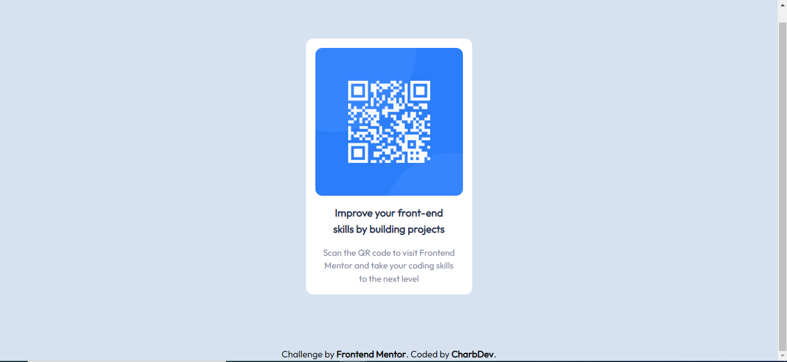

# Frontend Mentor - QR code component solution

This is a solution to the [QR code component challenge on Frontend Mentor](https://www.frontendmentor.io/challenges/qr-code-component-iux_sIO_H). Frontend Mentor challenges help you improve your coding skills by building realistic projects. 

## Table of contents

- [Overview](#overview)
  - [Screenshot](#screenshot)
  - [Links](#links)
- [My process](#my-process)
  - [Built with](#built-with)
- [Author](#author)
- [Getting Started](#getting-started)

## Overview

### Screenshot

### Links

- Solution URL: [Github Solution code source](https://github.com/charbossly/QR-Code)
- Live URL: [Solution Demo](https://clever-williams-e0da09.netlify.app/)

## My process

### Built with

- Html
- TailwindCss

## Author

- Github - [CharbelAssogba](https://github.com/charbossly)
- Frontend Mentor - [@charbossly](https://www.frontendmentor.io/profile/charbossly)
- Twitter - [@assogba_charbel](https://www.twitter.com/assogba_charbel)

## Getting Started

1.  Clone the repository

         git clone https://github.com/charbossly/QR-Code.git 

    Alternately you can download the zip file and unzip it.

2.  You will now have the cloned project folder. Open the project in
    Visual Studio Code editor (recommended code editor for Tailwind CSS
    Projects)

3.  Open new terminal within Visual Studio Code

4.  Download and install NPM - [A Beginner’s Guide to npm](https://www.sitepoint.com/npm-guide/)

5.  Install dependencies

        npm install

6.  Start using Tailwind CSS

        npm run dev

7.  Watch HTML files for changes and build automatically everytime using

    npm run watch

## Optimize for production

Before pushing your code (the `public` folder) for production, run the below command to reduce the size of `styles.css` within the public folder

     npm run prod

NOTE: If you are using Windows and face an error `NODE ENV not recognised`, run the below command

     npm install win-node-env
